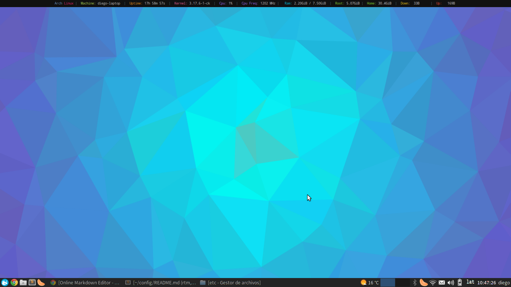
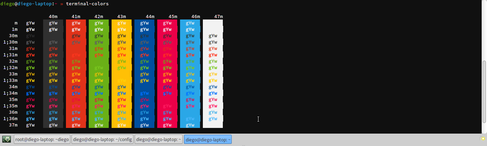

# Config
All steps i reproduced to set my [Archlinux] config.
You can find all the config files and system configuration files for my Archlinux  to set up a nice environment for development and daily use.

#Config files
* [Bumblebee config] to avoid errors
* [lightdm config] with better integration with xfce4
* [pulseaudio config] for better audio (?)
* [conkyrc config]
* [guake config] with color shceme from [guake colors elementary-os]
* [zsh config] files
* [Sublime Text 3 config]
* **and others** config's files

##Screenshots
####Archlinux desktop
[](https://github.com/drog/config/raw/master/screenshots/desktop.png)

####Guake colors
[](https://github.com/drog/config/raw/master/screenshots/guake.png)

## Zsh
```sh
pacman -S zsh zsh-completions
wget --no-check-certificate http://install.ohmyz.sh -O - | sh
sudo wget --no-check-certificate http://install.ohmyz.sh -O - | sh
chsh -s /bin/zsh
sudo chsh -s /bin/zsh
```

##xfce4 extras
```sh
pacman -S lxtask ffmpegthumbnailer poppler-glib gvfs gvfs-smb sshfs xdg-user-dirs xdg-user-dirs-gtk guake pavucontrol
yaourt -S xfce4-volumed-pulse xfce4-whiskermenu-plugin menulibre
xdg-user-dirs-update
xdg-user-dirs-gtk-update
```

##xfce4 eyecandy
```sh
yaourt -S xfce-theme-greybird xcursor-human xfce4-volumed-pulse elementary-xfce-icons-git xfce4-whiskermenu-plugin menulibre
```
####Cursor theme
`nano /usr/share/icons/default/index.theme`
```sh
[Icon Theme]
Inherits=Human
```
##xfce4 Lightdm integration
```sh
pacman -S lightdm-gtk2-greeter light-locker
```
`nano /etc/lightdm/lightdm.conf`
```sh
[SeatDefaults]
greeter-session=lightdm-gtk-greeter
```
####Wallpaper lightdm
`cp path/to/wallpaper.png /usr/share/pixmaps/wallpaper.png`

####lightdm-gtk-greeter
`nano /etc/lightdm/lightdm-gtk-greeter.conf`
```sh
[greeter]
background= /usr/share/pixmaps/wallpaper.png
theme-name=Greybird
icon-theme-name=elementary-xfce
```
##xfce4 Lightdm lightlock
####1.  Create systemd service
`nano /etc/systemd/system/lock.service`

```sh
[Unit]
Description=Lock X session
Before=suspend.target

[Service]
Type=oneshot
ExecStart=/usr/bin/xflock4

[Install]
WantedBy=suspend.target
```
####2.  Enable systemd service
`systemctl enable lock`

####3. Add light-locker to xflock4 script
`nano /usr/bin/xflock4`
```sh
#!/bin/sh
light-locker-command -l
```
[Source Xlock config]

##Codecs
```sh
pacman -S gstreamer0.10-{{bad,good,ugly,base}{,-plugins},ffmpeg}
```

##Compressed Files
```sh
pacman -S file-roller
pacman -S unrar zip unzip xz tar gzip bzip2 rpmextract

```

##nVidia Optimus Bumblebee
```sh
pacman -S bumblebee bbswitch primus lib32-primus lib32-virtualgl nvidia lib32-nvidia-utils
gpasswd -a diego bumblebee
systemctl enable bumblebeed
```
`nano /etc/mkinitcpio.conf `
```sh
MODULES="i915 bbswitch"
```
`nano /etc/default/grub`
```sh
GRUB_CMDLINE_LINUX_DEFAULT="quiet rcutree.rcu_idle_gp_delay=1"
```
`lspci | grep VGA | grep NVIDIA`
`nano /etc/bumblebee/xorg.conf.nvidia`
```sh
BusID "PCI:01:00:0"
```

[Source Bumblebee config]

##[linux-ck] Brain Fuck Scheduler (BFS)
```sh
pacman-key -r 5EE46C4C
pacman-key --lsign-key 5EE46C4C
pacman -S linux-ck-ivybridge linux-ck-ivybridge-headers nvidia-ck-ivybridge
yaourt -S bbswitch-ck acpi_call-ck
grub-mkconfig -o /boot/grub/grub.cfg
```

##Packages for programming
```sh
pacman -S mariadb mongodb ruby openssh nodejs apache php php-apache php-mcrypt php-gd php-composer gdb virtualbox jdk7-openjdk jre7-openjdk jre7-openjdk-headless

yaourt -S sublime-text-dev virtualbox-ext-oracle

npm install -g bower gulp grunt-cli yo sails generator-gulp-angular  generator-angular

#games
pacman -S tiled tinyxml sdl sdl_image sdl_gfx

#Networking
pacman -S nmap wireshark-cli wireshark-gtk john aircrack-ng
```

##Sublime Text 3 config
* Install  [Install Package Control](https://sublime.wbond.net/installation)

Open Sublime Text 3 and hit `ctrl+´` shortcut or the `View > Show Console` menu, then enter the following:
```bash
import urllib.request,os,hashlib; h = '7183a2d3e96f11eeadd761d777e62404' + 'e330c659d4bb41d3bdf022e94cab3cd0'; pf = 'Package Control.sublime-package'; ipp = sublime.installed_packages_path(); urllib.request.install_opener( urllib.request.build_opener( urllib.request.ProxyHandler()) ); by = urllib.request.urlopen( 'http://packagecontrol.io/' + pf.replace(' ', '%20')).read(); dh = hashlib.sha256(by).hexdigest(); print('Error validating download (got %s instead of %s), please try manual install' % (dh, h)) if dh != h else open(os.path.join( ipp, pf), 'wb' ).write(by)
```
Install and load packages (`ctrl-Shift-P`):
  * [BracketHighlighter](https://github.com/facelessuser/BracketHighlighter)
  * [ColorPicker](https://github.com/weslly/ColorPicker)
  * [SublimeCodeIntel](https://github.com/SublimeCodeIntel/SublimeCodeIntel)

Load user settings from [Sublime Text 3 config]

####Mariadb config
`systemctl start mysqld &&  /usr/bin/mysql_secure_installation`

##Power managment
```sh
pacman -S  tlp lm_sensors smartmontools lsb-release ethtool iw
systemctl enable tlp
sensors-detect
```
##Network Manager
```sh
pacman -S networkmanager networkmanager-openconnect network-manager-applet dnsmasq
systemctl enable NetworkManager
```

##Bluetooth
```sh
yaourt -S blueman-git
systemctl enable bluetooth
```
##Other stuff
```sh
pacman -S conky clementine gpicview wine winetricks wine_gecko xdelta3 pkgstats firefox-adblock-plus  firefox-i18n-es-cl transmission-gtk filezilla xchat  wget mpv libva libva-intel-driver thunderbird-i18n-es-ar  gtk-recordmydesktop skype galculator bleachbit preload ntfs-3g archey3
yaourt -S google-chrome profile-sync-daemon
#gaming
pacman -S steam desmume

#Multimedia extras
pacman -S  gimp gimp-plugin-gmic inkscape blender mkvtoolnix-gtk soundconverter
yaourt -S jdownloader2 teamspeak3 animecheck-git radiotray
#Ofimatic
pacman -S libreoffice-fresh-es hunspell-es hyphen-es libmythes mythes-es

#LaTeX
pacman -S texlive-core texlive-bibtexextra texlive-htmlxml texlive-humanities texlive-latexextra texlive-pictures texlive-publishers  texlive-science
```
##Better Fonts with [Infinality fonts]
`nano /etc/pacman.con`
```sh
[infinality-bundle]
Server = http://bohoomil.com/repo/$arch

[infinality-bundle-multilib]
Server = http://bohoomil.com/repo/multilib/$arch

[infinality-bundle-fonts]
Server = http://bohoomil.com/repo/fonts
```
```sh
pacman -S infinality-bundle infinality-bundle-multilib

pacman -S ibfonts-meta-base ibfonts-meta-extended-lt adobe-source-sans-pro-fonts adobe-source-serif-pro-fonts ttf-meslo-fonts-ibx

#Oriental fonts
pacman -S adobe-source-han-sans-cn-fonts adobe-source-han-sans-jp-fonts adobe-source-han-sans-jp-fonts adobe-source-han-sans-otc-fonts adobe-source-han-sans-tw-fonts
```

[Source Xlock config]:https://bbs.archlinux.org/viewtopic.php?id=180985
[linux-ck]:https://wiki.archlinux.org/index.php/linux-ck
[Source Bumblebee config]:https://bbs.archlinux.org/viewtopic.php?pid=1326090#p1326090
[Profile-sync-daemon]:https://wiki.archlinux.org/index.php/profile-sync-daemon
[Infinality fonts]:https://wiki.archlinux.org/index.php/Infinality
[Archlinux]:https://www.archlinux.org/
[guake colors elementary-os]:https://github.com/tatetian/guake-colors-elementary-os
[Bumblebee config]:https://github.com/drog/config/tree/master/etc/bumblebee
[lightdm config]:https://github.com/drog/config/tree/master/etc/lightdm
[pulseaudio config]:https://github.com/drog/config/blob/master/etc/pulse/daemon.conf
[conkyrc config]:https://github.com/drog/config/blob/master/home/diego/.conkyrc
[guake config]:https://github.com/drog/config/tree/master/home/diego/.config/gconf/apps/guake
[zsh config]:https://github.com/drog/config/tree/master/home/diego/.zsh
[Sublime Text 3 config]:https://github.com/drog/config/tree/master/home/diego/.config/sublime-text-3/Packages/User/Preferences.sublime-settings